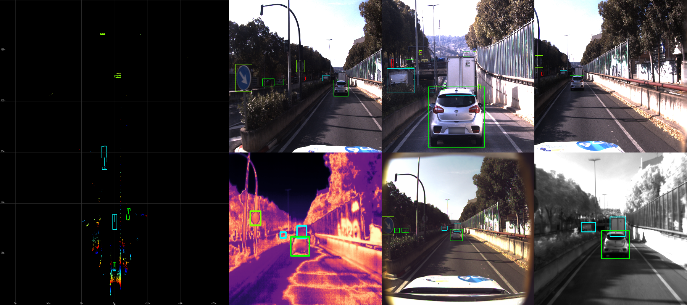
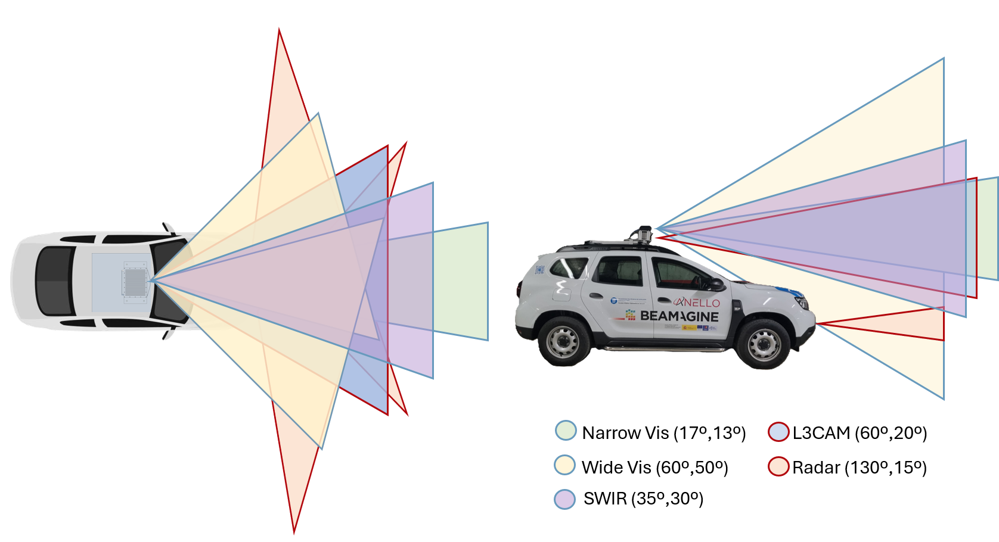
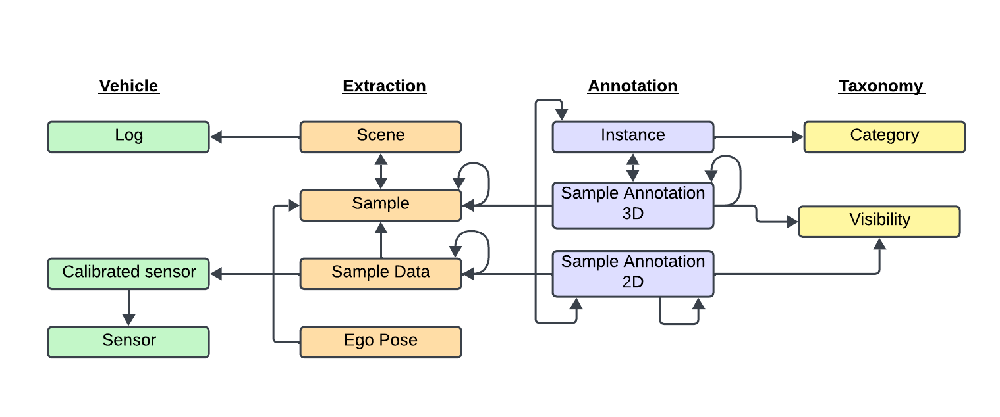

<div align="center">

# USEFUL Devkit

**The official Python toolkit for the USEFUL multimodal autonomous driving perception dataset.**

[](https://www.python.org/)
[](LICENSE)
[](https://huggingface.co/datasets/GerardDMG/USEFUL)
<!-- [](https://arxiv.org/abs/PLACEHOLDER) -->

</div>

---

USEFUL is a multimodal autonomous driving dataset featuring **9 synchronized sensor streams** — LiDAR, Radar, and five camera modalities including SWIR, Thermal, and Polarimetric — paired with accurate **3D and 2D annotations** and **GPS/INS ego-pose** data.

This devkit provides a Python API to load, query, visualize, and export all data in the dataset.

<div align="center">
<p align="center">
  
</p>
</div>

---

## Sensor Modalities

| Channel | Modality | Description |
|---------|----------|-------------|
| `LIDAR` | LiDAR | 3D point cloud, XYZIRGB format |
| `RADAR_LEFT` | Radar | Left-side radar with Doppler velocity |
| `RADAR_RIGHT` | Radar | Right-side radar with Doppler velocity |
| `WIDE_LEFT` | RGB Camera | Wide-angle left camera |
| `NARROW` | RGB Camera | High-resolution narrow front camera |
| `WIDE_RIGHT` | RGB Camera | Wide-angle right camera |
| `LWIR` | Thermal | Long-wave infrared (thermal) camera |
| `SWIR` | SWIR | Shortwave infrared camera |
| `POLARIMETRIC` | Polarimetric | Full Stokes polarimetric camera (DOLP, AOLP, RGB0/45/90/135) |

The LiDAR sensor used is not a conventional rotatory LiDAR. It is an `L3CAM`, produced by [Beamagine S.L.](https://beamagine.com/), multimodal embbeded system containing a thermal camera, a polarimetric camera and a MEMs-based quasi-solid state LiDAR that produce high-density point clouds within a FOV of (60º, 20º).

<div align="center">
<p align="center">
  
</p>
</div>

---


## Dataset Structure

The dataset is organized into 12 JSON metadata tables stored under `<dataroot>/<version>/`:

| Table | Description |
|-------|-------------|
| `log` | Top-level recording sessions |
| `scene` | Short clips within a log (a few seconds each) |
| `sample` | Synchronized multimodal frames; linked list via `next`/`prev` |
| `sample_data` | Individual sensor files per sample (one per channel) |
| `sample_annotation` | 3D bounding boxes in the LiDAR/ego frame |
| `sample_annotation_2d` | 2D bounding boxes in the camera frame |
| `sensor` | Sensor metadata (modality + channel name) |
| `calibrated_sensor` | Extrinsic/intrinsic calibration for each sensor |
| `instance` | Object identity tracked across frames |
| `category` | Object class definitions |
| `visibility` | Per-annotation visibility levels (1–4) |
| `ego_pose` | Vehicle GPS/INS pose at each timestamp |

Every record is uniquely identified by a **32-character hex token**. Records are accessed via:

```python
record = usfl.get('sample', token)
```

<div align="center">
<p align="center">
  
</p>
</div>

---

## Installation

```bash
git clone https://github.com/GDMG99/useful-devkit.git
cd useful-devkit
pip install -e .
```
---
## Quick Start

```python
from useful import USEFUL

# Load dataset
usfl = USEFUL(version='v0.0', dataroot='/path/to/data/useful', verbose=True)

# Browse available scenes
usfl.list_scenes()

# Pick a scene and get its samples
scene_token = usfl.scene[0]['token']
sample_tokens = usfl.get_sample_tokens_in_scene(scene_token)

# Render a multimodal sample (all 6 cameras + LiDAR + 3D annotations)
canvas, geometries = usfl.render_sample(
    sample_tokens[0],
    with_anns=True,
    with_lidar=True,
    canvas_shape=(2, 3),
    canvas_order=['WIDE_LEFT', 'NARROW', 'WIDE_RIGHT', 'LWIR', 'POLARIMETRIC', 'SWIR'],
)

# Export a full scene as video
usfl.render_scene(scene_token, save_path='scene_output.mp4', fps=7)
```
---

## Tutorial

A full step-by-step tutorial notebook covering all modalities, annotations, visualization, instance tracking, video export, and map rendering is available at:

**[`tutorials/tutorial.ipynb`](tutorials/tutorial.ipynb)**

---
## mmdetection3d support
To obtain `mmdet3d` pkl files run:
```bash
python src/useful/utils/create_mmdet3d_pkl.py \
-v {VERSION} \
-p {DATAROOT} \
-s {SPLIT: test train val | supports multiple splits} \
-o {OUTPUT} \
--verbose 
```
---
## Acknowledgements

This work would not have been possible without the open-source works of [nuScenes](https://github.com/nutonomy/nuscenes-devkit) and [Truckscenes](https://github.com/TUMFTM/truckscenes-devkit).

---
## Citation

If you use the USEFUL dataset or this devkit in your research, please cite:

```bibtex
@misc{gerard_demas-giménez_2026,
	author       = { Gerard DeMas-Giménez and Adrià Subirana and Pablo García-Gómez and Eduardo Bernal and Josep R. Casas and Santiago Royo },
	title        = { USEFUL (Revision 0e2fc7e) },
	year         = 2026,
	url          = { https://huggingface.co/datasets/GerardDMG/USEFUL },
	doi          = { 10.57967/hf/8147 },
	publisher    = { Hugging Face }
}
```

---

<div align="center">
<p align="center">
  
</p>
</div>
